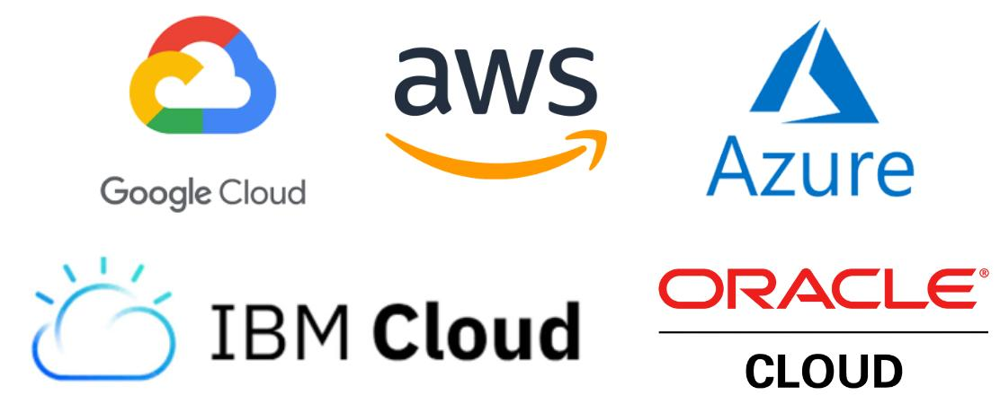

# Responsibly Decommissioning Unused Cloud-Based Systems

Consider this scenario:

You have been tasked with retiring an old, unused or unneeded system. You want to shut down all the associated components and ensure you don't leave behind any lingering resources.

This is not at all uncommon. There are many possible motivations for retiring a software system:

- Perhaps your organization is migrating cloud providers or adapting its architecture.
- Perhaps the software libraries have reached end-of-life and its time to say goodbye.
- Perhaps the business has decided to sunset a particular product offering the components were part of.
- Perhaps the system has been superseded by a superior application, replaced by a third-party offering or consolidated into some other service.

Such an activity should follow a systematic and rigorous approach. Doing so will ensure the following outcomes can be achieved:

- Any compliance obligations are fulfilled.
- Possible security risks are mitigated.
- Maximum cost savings are delivered for the business.
- The organization's environments are clean and easy to maintain.

## Scope

The above scenario is quite broad. To keep this guide focused, I will limit the scope to the decommissioning process for resources deployed in the [AWS Cloud](https://docs.aws.amazon.com) and the related code, monitoring and [CI/CD](https://en.wikipedia.org/wiki/CI/CD).

The principles explored can be generalized and adapted to other cloud providers, such as the [Google Cloud Platform](https://cloud.google.com/docs) (GCP) and [Microsoft Azure](https://docs.microsoft.com/azure).

Not everything in this guide will be relevant to your specific use case. It may instead prove useful as a general checklist to follow when retiring components from your system.

## Guide

### Investigation phase

The goals of the investigation phase are to:

- Discover where the service is deployed or has resources.
- Confirm the service is no longer used or referenced anywhere.

This phase will enable the service to be responsibly and fully shut down, thereby achieving the security and compliance criteria along with the cost savings and maintainability outcomes.

The first thing to keep in mind is that there is no "one size fits all" approach.

Shutting down orphaned components reliably will require at least some investigation of the system or sub-system. Depending on the size and scale of the system, and your familiarity with it, this may take several minutes to several hours, or even days.

You may be in luck if a standard workflow was followed when the system was being built. If, however, the system lacks sufficient documentation or a subject matter expert, then you may spend considerable time in the investigation phase.

Your investigation should answer the following:

#### Are the resources deployed across multiple AWS accounts, or in multiple AWS regions?

Perhaps the system is deployed in a development, testing or staging environment in addition to the production environment. Its possible not all resources exist in all environments.

Perhaps the system is deployed in one AWS region, or multiple. Its possible the production deployment is in multiple AWS regions, and development, testing or staging environments only in one.

#### Where does the system read or write data?

Perhaps the service obtains data from some third-party provider, or the broader web.

Perhaps the service imports and/or exports data to storage shared by other components.

Perhaps the service reads and writes data to storage it itself owns.

#### Where is the source code located?

Perhaps the source code is version controlled and stored in an [AWS CodeCommit](https://docs.aws.amazon.com/codecommit) repository, or some other code hosting service like [GitHub](https://docs.github.com) or [Bitbucket](https://bitbucket.org/product/guides).

Its possible the source code is distributed across multiple repositories.

#### How is the system deployed?

Perhaps the system is fully or partially managed using [Infrastructure as Code](https://en.wikipedia.org/wiki/Infrastructure_as_code) (IaC), provisioned via [CloudFormation](https://docs.aws.amazon.com/cloudformation), [Terraform](https://www.terraform.io/docs) or some other alternative. Its possible some resources are deployed outside of this workflow.

If there are resources not part of IaC, you will have to track them down. If the developers made consistent use of [tagging](https://docs.aws.amazon.com/general/latest/gr/aws_tagging.html), then doing so should be easy. The system's documentation (if there is any) may also offer insight.

Perhaps there is an automated process for deployments, such as [AWS CodePipeline](https://docs.aws.amazon.com/codepipeline), or some third-party alternative like [Jenkins](https://www.jenkins.io/doc).

You should also check for any references to the service outside of the sub-system, and confirm whether the service is still in use. To do so:

1. If there is any logging available, check the log group(s) to discover any ingress or egress.
2. If the component is invoked via a URL or ARN, search for usages in the codebases of other components.
3. Check if any policies in other components, or any [IAM](https://docs.aws.amazon.com/iam) roles reference the service or its components.

### Backup phase

The goal of the backup phase is to:

- Prepare a recovery plan in case it is needed.
- Responsibly handle data created or used by the service.

Before shutting down a service, you may wish to prepare for the possibility that such an action may have to be reverted at some point in the future.

Perhaps the service is suddenly "needed" again, or perhaps something was overlooked during the investigation phase. Whatever the case may be, you may wish to consider taking steps so that a recovery is possible if need be.

Achieving this may not always be possible or even relevant. You should therefore take a pragmatic approach.

Keep in mind that shutting down a service does not have to mean that every trace of its existence is destroyed. However, this may be necessary to meet compliance or legal requirements.

If the system is managed with IaC and deployed via an automated process, then recovery should be simple.

For resources deployed independently of IaC, you can use the following approach to enable speedy recovery:

1. Use the `describe` sub-command from the [AWS CLI](https://docs.aws.amazon.com/cli/latest/search.html?q=describe) to "export" the current state of the resource(s).
2. Optionally, you can [import the resources](https://docs.aws.amazon.com/AWSCloudFormation/latest/UserGuide/resource-import-existing-stack.html) into a CloudFormation stack, keeping in mind that [not all resource types](https://docs.aws.amazon.com/AWSCloudFormation/latest/UserGuide/resource-import-supported-resources.html) are supported.

If recovering the service is ever necessary, you will need to retain a copy of the infrastructure configuration, any associated source code and any data needed by the service.

This leads into the other goal of the backup phase, which is that of managing the service's data.

How this is handled will depend on the type of data and its location.

If the data is not sensitive or copyrighted, then you are in luck.

Otherwise, perhaps the data is sensitive, such as private customer or financial data. Or, perhaps the data is copyrighted material or trade secrets.

Your organization may have its own data handling policies which govern the retention period and/or destruction regulations of such information. If not, you should seek guidance as necessary.

Loosely speaking, there are three general scenarios:

#### The data is stored in a data store also used by other components

In such a case, you may not need to do anything. The data store would likely have to remain in place. Whether the data itself needs to be retained or not depends purely on whether its still needed by another component.

#### The data is stored in a data store owned by the service itself

If this is the case, then logic dictates that the data should die naturally with the service upon decommissioning. It should no longer be needed. However; it may still make sense to retain a backup, at least temporarily.

#### The data is stored in some external or third-party system

Its possible the data used or generated by the service was transmitted to a third-party or uploaded to some external system. It will probably not make sense for the data to reside on those systems anymore. It may have to be transferred to an internal system.

Whatever the case may be, if the intention is to delete data as part of the shut down process, then retaining a backup should be considered. For example:

- If the storage is in [RDS](https://docs.aws.amazon.com/rds) or [DynamoDB](https://docs.aws.amazon.com/dynamodb), you can easily retain a snapshot of the entire database.
- If the storage is an [S3](https://docs.aws.amazon.com/s3) bucket, you can either transition the data to a different storage class and detach the bucket from the service stack, or copy the data elsewhere.

### Shut down phase

Upon completion of the investigation and backup phases, you are ready to start the fun.

The shut down phase could take minutes, hours or days – depending on the size and scale of the system along with the complexity of the deployment/undeployment strategy.

#### Monitoring and alerting

You should start by removing all monitoring and alerting associated with the system.

There may be a [CloudWatch](https://docs.aws.amazon.com/cloudwatch) log group with alarm(s) configured. If they are not managed with IaC, they will have to be manually deactivated. Similarly, automated alerts triggered via third-party services like [PagerDuty](https://developer.pagerduty.com/docs) or [Opsgenie](https://docs.opsgenie.com/docs) should also be disabled.

There may be dashboards configured in external tools like [Kibana](https://www.elastic.co/guide/en/kibana) and [Grafana](https://grafana.com/docs/grafana). These should be removed, along with any monitoring configuration.

#### Undeployment

You can then "undeploy" the service.

With IaC, this is usually a single command to delete or destroy the stack or configuration. This will delete all resources part of that stack or configuration. Keep in mind that a service may sometimes be deployed using multiple stacks or configurations.

You will have to manually delete any resource not managed with IaC. For example, this may be a [VPC](https://docs.aws.amazon.com/vpc), or a [Route53](https://docs.aws.amazon.com/route53) entry for the service, or assets stored in the [Secrets Manager](https://docs.aws.amazon.com/secretsmanager) or [Parameter Store](https://docs.aws.amazon.com/systems-manager).

#### Build artifacts

Next, you should delete any [build artifacts](https://en.wikipedia.org/wiki/Artifact_(software_development)).

Build artifacts and related assets may be stored in an S3 bucket, an [ECR](https://docs.aws.amazon.com/ecr) repository or a [CodeArtifact](https://docs.aws.amazon.com/codeartifact) repository. These should be emptied.

There may be a separate stack or configuration for the build artifacts. If so, this should be deleted.

#### Source code and CI/CD

Finally, the focus turns to the source code repository and CI/CD.

You should remove the project from [CodePipeline](https://docs.aws.amazon.com/codepipeline), [Jenkins](https://www.jenkins.io/doc), [CircleCI](https://circleci.com/docs), or whichever CI/CD solution is being used -- if any. There could also be multiple.

You should switch off any code scanning enabled on the source code via [Amazon CodeGuru](https://docs.aws.amazon.com/codeguru) or other third-party services like [SonarQube](https://docs.sonarqube.org).

Finally, you should decide what to do with the source code itself. Its usually a good idea to retain the code for posterity rather than deleting it. It may prove to be a useful reference. If your code hosting solution provides "archiving" functionality (e.g. GitHub), you can mark the repository as archived. Otherwise, you can relocate the repository to a separate "archive project" if your code hosting provider supports this (e.g. Bitbucket). If either of the above is not possible, you can simply rename the repository with some intuitive prefix indicating its "archived". You should adopt a standard convention across your organization.

You should also update the documentation in the source code repository, the repository metadata and wherever else applicable, to reflect that the system has been decommissioned and the repository is in an archived state.

---

The original sources are available on [GitHub](https://github.com/costaparas/Decommissioning-Software-Components).

*Please consider the environment before printing.*
